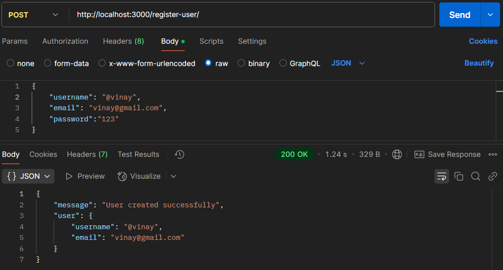
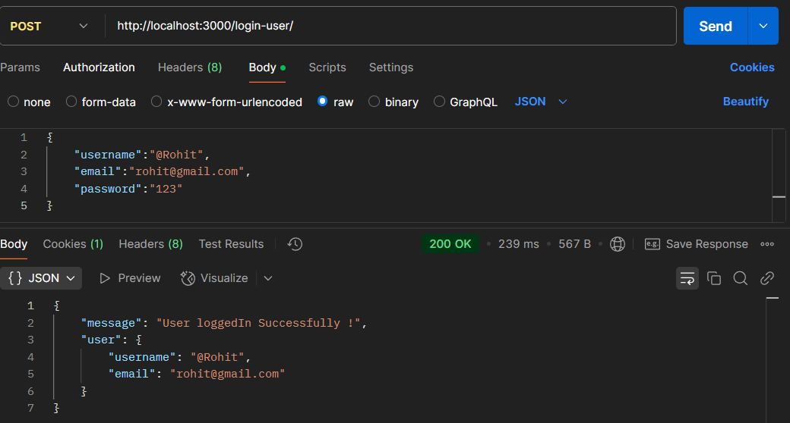
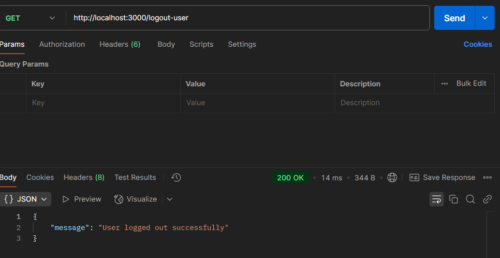
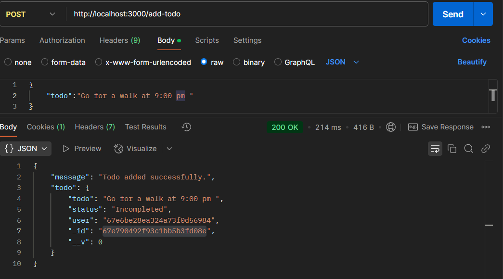
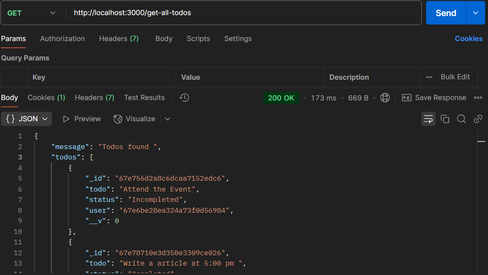
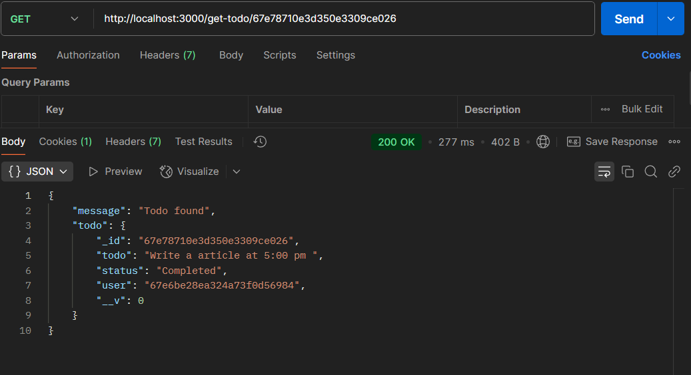
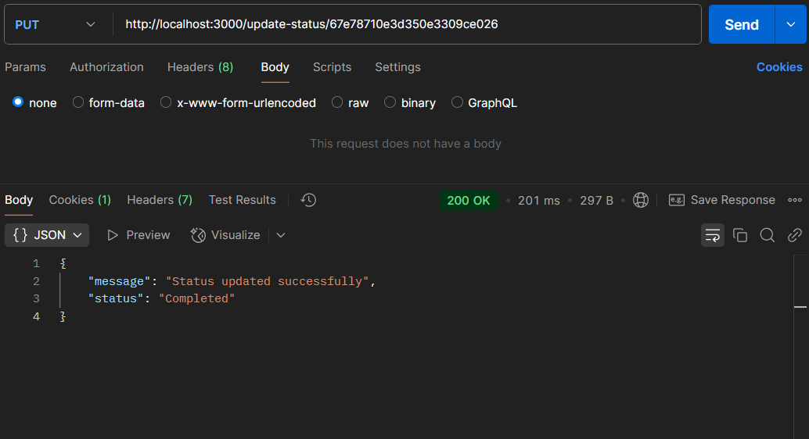
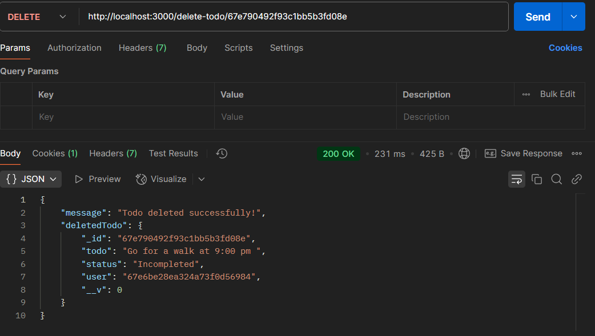

# Todo Assignment

A simple Express.js-based REST API for managing a Todo list using Mongodb.

# End Points

## User Authentication

1. **Register User:**  
   - Register a new user.  
   

2. **Login User:**  
   - Log in a user.  
   
  
3. **Logout User**  
   - log out a user.  
   

## Todo endpoints

1. **Add Todo:**  
   - Adds a new todo item to the list.  
   

2. **Get All Todos:**  
   - Retrieves a list of all todo items.  
   
  
3. **Get Todo by ID:**  
   - Retrieves a specific todo item based on its ID.  
   

4. **Update Todo Status:**  
   - Updates the status of a specific todo item (toggles between "Completed" and "Incompleted").  
   
 
5. **Delete Todo:**  
   - Deletes a specific todo item.  
   
